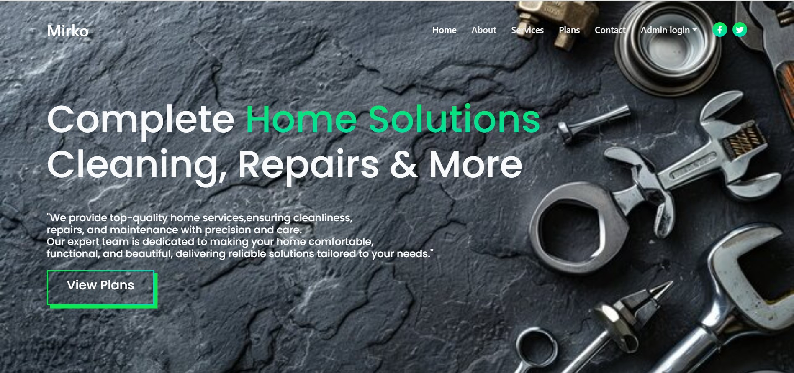

# 🏠 Complete Home Solutions – Web Application

This project is a **Home Services Web Application** that provides users with easy access to **cleaning, repair, and maintenance services**.  
The platform showcases service details, subscription plans, and contact options with a modern responsive design.

## 📷 Project Preview

## ✨ Features
- 🧹 **Professional Cleaning** – Deep cleaning for homes.  
- 🔧 **Expert Repairs** – Plumbing, electrical, and general repair services.  
- 🎨 **Painting Services** – Interior & exterior home painting.  
- 🪚 **Carpentry** – Customized furniture and woodwork.  
- 🔒 **Security Systems** – CCTV, alarms, and smart locks installation.  
- ❄️ **HVAC & Appliance Repairs** – AC servicing and appliance maintenance.  
- 📞 **Contact Form** – Users can submit service queries.  
- 📍 **Google Maps Integration** – Shows service location.  
- 📱 **Responsive Design** – Works seamlessly across devices.

## 🛠️ Technologies Used
- **HTML5**, **CSS3**, **JavaScript**  
- **Bootstrap 5** – Responsive layout  
- **FontAwesome** – Icons  
- **AOS (Animate on Scroll)** – Smooth animations  
- **Swiper.js** – Image sliders  
- **Google Maps Embed API** – Location integration  
- **LocalStorage** – Save submitted queries  

## 📦 Requirements
See the [requirements.txt](requirements.txt) file for all external libraries and dependencies used in this project.
